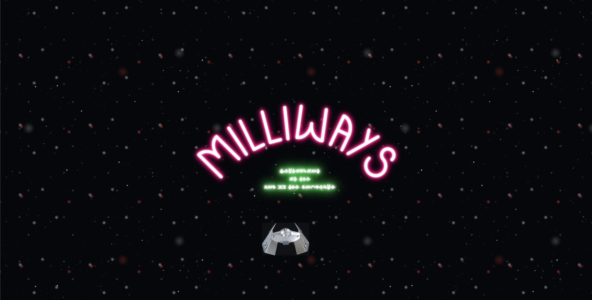
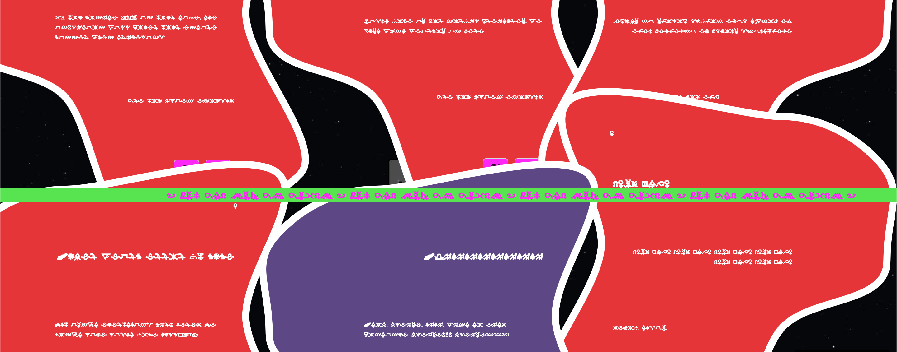
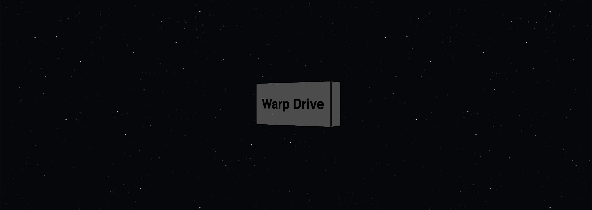
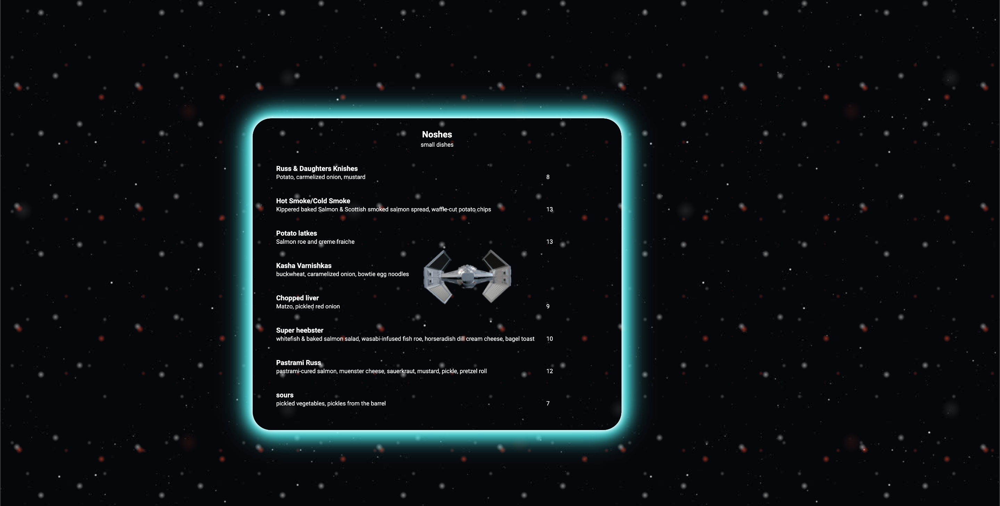
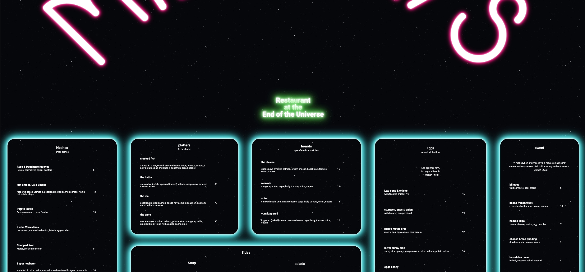

[Live Demo](https://aaraar.github.io/css-to-the-rescue-1920)

# The restaurant at the end of the universe

## Table of contents
- [Description](#a-cosmic-journey-that-pisses-off-multiple-sci-fi-fanbases)
- [How to install](#how-to-install)
    + [Requirements](#requirements)
    + [Step by step](#step-by-step)
- [How to use](#how-to-use)
- [Checklist](#checklist)

## A cosmic journey that pisses off multiple Sci-fi fanbases 

In three weeks I create an innovative, experimental, yet pleasurable user experience by using CSS and SVG. No Javascrpt allowed.
The  goal is to create a cosmic journey to the restaurant at the end of the universe, experimenting with media queries for color (dark/light), language settings, reduced motion etc.

## How to install
### Requirements
- Node
- Yarn

# Step by step
1. Clone the project
2. Open terminal and navigate to the directory
3. Run `yarn`
4. Run `yarn dev`
5. Open a browser and navigate to [localhost:10001](http://localhost:10001)
#### Or go straight to [aaraar.github.io/css-to-the-rescue-1920](https://aaraar.github.io/css-to-the-rescue-1920)

## How to use
The journey has several layers to display the menu.
When opening the site in light-mode (OS or browser setting) there will be all kinds of pop-ups blocking you from using the site.

These pop-ups will be in an alien language, however they contain the crucial hint to continue. Either change the HTML lang from '👽' to 'en' to read it or copy and paste it somewhere else.
When the OS or browser is in darkmode, these pop-ups disappear and you can use the warpdrive (Star Trek reference in a D. Adams Joke? Yes!)

Click it and a Tie fighter will appear and flies through space (EVEN STAR WARS JOKES!!?? YES!!)
You will fly to the restaurant at the end of the universe and the menu portions will fly by.

Did not get a chance to read it?
Maybe try flying with a reduced motion (hint)

## Checklist
- [x] Fly through space
- [x] Moving menu parts
- [x] Menu layout with grid
- [x] Cursor simulates spaceship
- [x] Alien language on light mode
- [X] Reduced motion menu
- [x] Pop-ups
- [ ] Hold menu parts when flying through
- [ ] Interactivity
- [ ] Dynamic menu layout

## Learning goals
- _Understanding the broader scope of CSS: You can show that CSS can be used for more than just styling web pages._
- _Understanding the progressive enhancement parts of CSS: You can show that you can use the cascade, inheritance and specificity in your project_
- _Understanding the interactive parts of CSS: Is the UX fully enhanced within in given CSS scope?_
- _Stretching the learning goals as far as possible_

Goals of this week: 

- Be inspired
- Discuss hot CSS topics.
- Get going!

<!-- [Opdrachten](https://drive.google.com/open?id=1OVhWQNaCgSluYviTKKWcApkyPd23xow1PiExb8GYANM) -->

<!-- [Slides](https://drive.google.com/open?id=1Rjl9xqXoKniQSRJPdkU1O5YwWC33SJK8KiV0a-H_xZU) -->

<!-- [Opdrachten](https://drive.google.com/open?id=13pKQu72pshaEzKw9q5JHLa-aop85nMP6nDCdqioWjoQ) -->

<!-- [Slides](https://drive.google.com/open?id=1BSzGYNLMgtHD4HRnK7f0DgyTv4Pg3xsQwD_eYNo7v0Y) -->

<!-- ☝️ replace this description with a description of your own work -->

<!-- Add a nice image here at the end of the week, showing off your shiny frontend 📸 -->

<!-- Maybe a table of contents here? 📚 -->

<!-- How about a section that describes how to install this project? 🤓 -->

<!-- ...but how does one use this project? What are its features 🤔 -->

<!-- What external data source is featured in your project and what are its properties 🌠 -->

<!-- Maybe a checklist of done stuff and stuff still on your wishlist? ✅ -->

<!-- How about a license here? 📜 (or is it a licence?) 🤷 -->
